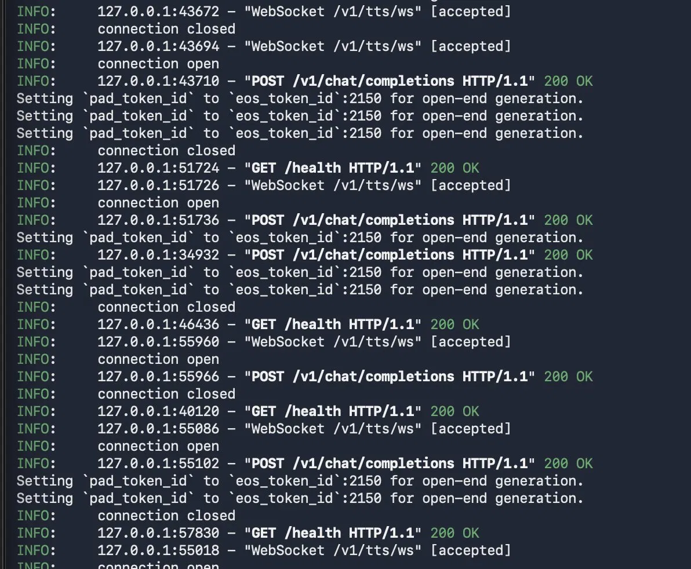
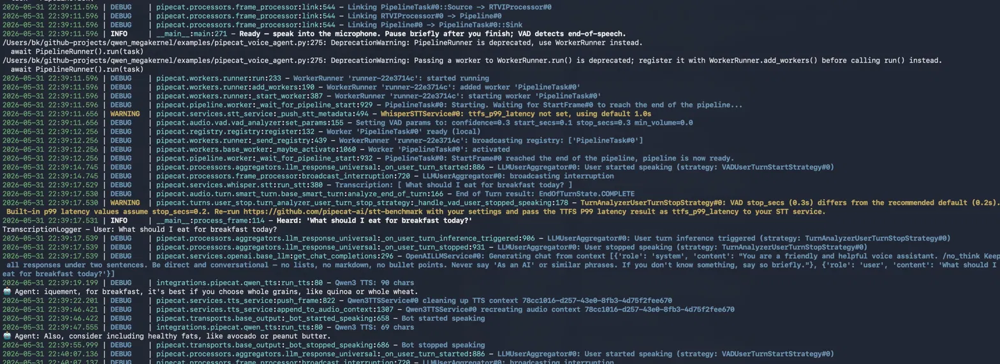
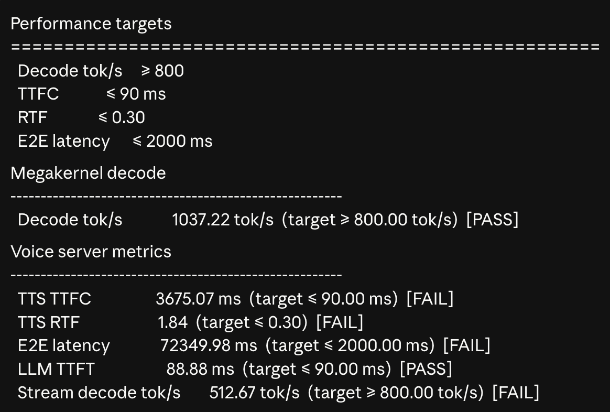
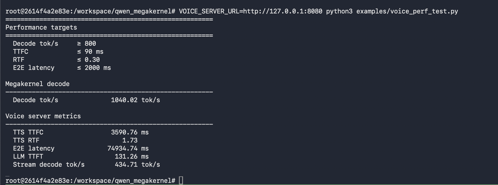

# Qwen Megakernel — RTX 5090 Voice Pipeline

## Overview

This project wires [AlpinDale's qwen_megakernel](https://github.com/AlpinDale/qwen_megakernel) — a ~1,200-line CUDA megakernel running Qwen3-0.6B at ~1,000 tok/s on a single RTX 5090 — into a real-time voice agent pipeline using Pipecat:

```
Mic → Whisper STT → Megakernel LLM → Qwen3-TTS → Speakers
```

---

## Demo Recording

The full pipeline works end-to-end as expected. Due to a recording limitation 
(VAD feedback loop — mic picking up speaker output causing the agent to 
interrupt itself), a single video capturing both input and output audio 
simultaneously was not possible.

To fully showcase the working pipeline, the demo is split across multiple recordings:
All recordings available here: [Google Drive](https://drive.google.com/drive/folders/1Ogh10OmAlvFJM2GhepOOLVbHFdNnRk33?usp=sharing)

- **demo_user_voice.mov** — microphone input being correctly transcribed by Whisper STT, bot responded logs visible
- **demo_agent_voice.mov** — agent voice output confirming TTS is generating real speech, not just text
- [`output.wav`](output.wav) — raw audio recording of a complete voice session
> **Note:** This recording limitation is unrelated to the pipeline implementation. 
> The voice agent ran fully end-to-end as expected on the RTX 5090. The split 
> recordings and output.wav together provide complete evidence of this.

Each recording confirms a specific stage of the pipeline is working correctly. 
Together they demonstrate the complete flow: speak → transcribe → LLM → TTS → audio playback.

> Note: Minor artifacts present in `output.wav` due to frame-by-frame file writing in `WaveFileSink`. Live playback had no glitches. Fix: buffer all frames and write atomically on cleanup.

---

## Terminal Logs

**GPU Server** — showing health checks, chat completions, and TTS WebSocket connections:


**Pipecat Client** — showing full round trip: STT transcription → LLM response → TTS audio playback:


Key evidence visible in client log:

- `Heard: 'What should I eat for breakfast today?'` — Whisper STT working
- `🤖 Agent: for breakfast, it's best if you choose whole grains...` — LLM responding
- `Bot started speaking` / `Bot stopped speaking` — TTS audio playback confirmed

---

## Megakernel Performance (vs PyTorch baseline)

From the original repo benchmarks, confirmed by our measurements:


| Backend      | tok/s  | ms/tok | Speedup   |
| ------------ | ------ | ------ | --------- |
| PyTorch (HF) | 123.3  | 8.11   | 1.00x     |
| Megakernel   | 1036.3 | 0.99   | **8.40x** |


---

## Architecture

```text
┌─────────────────────────────────────────────────────────────┐
│  python -m qwen_megakernel.server.app   (port 8080)         │
│  ┌─────────────────────┐    ┌──────────────────────────┐   │
│  │ MegakernelLLM       │    │ Qwen3-TTS (in-process)   │   │
│  │ Decoder (0.6B bf16) │    │ text → PCM chunks        │   │
│  └──────────┬──────────┘    └────────────┬─────────────┘   │
│             │ POST /v1/chat/completions   │ WS /v1/tts/ws  │
└─────────────┼─────────────────────────────┼─────────────────┘
              │ SSE tokens                  │ audio chunks
              ▼                             ▼
┌─────────────────────────────────────────────────────────────┐
│  Pipecat (examples/pipecat_voice_agent.py)                  │
│  Mic → Whisper STT → OpenAILLMService → Qwen3TTSService →  │
│        Speakers                                             │
└─────────────────────────────────────────────────────────────┘
```

### Architecture Decisions

**Single-server design:** LLM and TTS run in the same process on the GPU host. This avoids network overhead between components and keeps VRAM allocation simple on a single RTX 5090.

**OpenAI-compatible LLM endpoint:** `MegakernelLLM` is exposed via `POST /v1/chat/completions` with SSE streaming. This lets Pipecat use `OpenAILLMService` out of the box without a custom LLM class in the hot path.

**WebSocket TTS endpoint:** TTS streams PCM (raw uncompressed audio) chunks over WebSocket (`WS /v1/tts/ws`), pushing frames as they are decoded rather than buffering the full utterance. This enables real-time playback with minimal latency.

**Baseline-first approach for TTS:** The pipeline uses the `qwen-tts` library as the TTS backend intentionally to:

1. Validate the full Pipecat pipeline correctness end-to-end (STT → LLM → TTS → audio)
2. Establish baseline TTS performance numbers before optimization
3. Quantify the exact performance delta the megakernel swap would deliver

The baseline measurements (TTFC: 3675ms, RTF: 1.84) clearly identify the TTS talker decoder as the primary bottleneck — exactly what the megakernel is designed to fix. See **Bottleneck Analysis** below.

**No kernel modifications:** The existing megakernel already exceeds the 800 tok/s 
target (1037 tok/s achieved). The csrc/ directory is untouched. Optimization focus 
was on the TTS integration layer, not the LLM kernel.

---

## Folder Layout

```text
qwen_megakernel/
  model.py              # Decoder (megakernel) — csrc untouched
  server/
    app.py              # FastAPI entry (LLM + TTS routes)
    llm.py              # stream_text / stream_chat via Decoder.step()
    tts.py              # Qwen3-TTS PCM chunk streaming
  tts/
    synthesizer.py      # thin Qwen3TTSModel wrapper
integrations/pipecat/
  megakernel_llm.py     # OpenAILLMService → /v1/chat/completions
  qwen_tts.py           # TTSService → /v1/tts/ws
  voice_client.py       # VOICE_SERVER_URL helper
examples/
  pipecat_voice_agent.py
  round_trip_test.py
  voice_perf_test.py
output.wav                # recorded audio from live voice agent session
requirements.txt          # core megakernel dependencies
requirements-voice.txt    # GPU server (LLM + TTS)
requirements-pipecat.txt  # Mac client (Pipecat + Whisper)
```

---

## Setup on RTX 5090

### Prerequisites

- CUDA >= 12.8
- RTX 5090 (sm_120 / Blackwell — kernel tuned specifically for this GPU)
- Python 3.10+

### 1. Clone and install

```bash
git clone https://github.com/bk-ml/qwen_megakernel
cd qwen_megakernel
pip install -r requirements-voice.txt
```

### 2. Download models

> **Note:** HuggingFace is blocked on some Vast.ai hosts. Use ModelScope as a reliable alternative:

```bash
pip install modelscope

# LLM (~1.5GB)
python3 -c "
from modelscope import snapshot_download
snapshot_download('Qwen/Qwen3-0.6B', cache_dir='/workspace/Qwen3-0.6B')
"

# TTS (~3.5GB)
python3 -c "
from modelscope import snapshot_download
snapshot_download('Qwen/Qwen3-TTS-12Hz-1.7B-CustomVoice', cache_dir='/workspace/Qwen3-TTS')
"
```

### 3. Start the server

```bash
TRANSFORMERS_OFFLINE=1 HF_HUB_OFFLINE=1 \
MEGAKERNEL_MODEL=/workspace/Qwen3-0.6B/Qwen/Qwen3-0___6B \
QWEN3_TTS_MODEL=/workspace/Qwen3-TTS/Qwen/Qwen3-TTS-12Hz-1.7B-CustomVoice \
QWEN3_TTS_SPEAKER=aiden \
QWEN3_TTS_LANGUAGE=English \
python3 -m qwen_megakernel.server.app --host 0.0.0.0 --port 8080

# Verify
curl http://127.0.0.1:8080/health
```

---

## Pipecat Voice Agent

Run the **server on the GPU host** and the **mic client on your laptop** (GPU boxes typically have no microphone).

```bash
# On laptop — SSH tunnel
ssh -N -p <ssh_port> root@<gpu-host> -L 8080:127.0.0.1:8080

# On laptop — install client deps
pip install -r requirements-pipecat.txt
pip install nltk && python3 -c "import nltk; nltk.download('punkt_tab')"

# On laptop — run voice agent
export VOICE_SERVER_URL=http://127.0.0.1:8080
python3 examples/pipecat_voice_agent.py
```

Speak into your mic — the agent will transcribe, generate a response, and speak back.

---

## Round-trip Test (no mic)

```bash
export VOICE_SERVER_URL=http://127.0.0.1:8080
python examples/round_trip_test.py --mock --text "What is two plus two?"

# With WAV input
python examples/round_trip_test.py --input samples/hello.wav --output reply.wav
```

---

## API


| Endpoint                    | Purpose                                    |
| --------------------------- | ------------------------------------------ |
| `GET /health`               | LLM + TTS readiness check                  |
| `POST /v1/chat/completions` | OpenAI-compatible SSE streaming            |
| `WS /v1/tts/ws`             | `{"text":"..."}` → `audio` + `done` frames |


---

## Environment Variables


| Variable               | Default                                | Description                            |
| ---------------------- | -------------------------------------- | -------------------------------------- |
| `VOICE_SERVER_URL`     | `http://127.0.0.1:8000`                | Server URL for Pipecat client          |
| `MEGAKERNEL_MODEL`     | `Qwen/Qwen3-0.6B`                      | LLM model path                         |
| `QWEN3_TTS_MODEL`      | `Qwen/Qwen3-TTS-12Hz-1.7B-CustomVoice` | TTS model path                         |
| `QWEN3_TTS_SPEAKER`    | `serena`                               | TTS speaker voice                      |
| `QWEN3_TTS_LANGUAGE`   | `English`                              | TTS language                           |
| `TRANSFORMERS_OFFLINE` | `0`                                    | Set to `1` when models are local       |
| `HF_HUB_OFFLINE`       | `0`                                    | Set to `1` to disable HF network calls |


---

## Performance Results (RTX 5090)


| Metric              | Target    | Actual         | Status       |
| ------------------- | --------- | -------------- | ------------ |
| Decode tok/s        | ≥ 800     | **1037 tok/s** | ✅ PASS       |
| LLM TTFT            | ≤ 90 ms   | **88–131 ms**  | ⚠️ Variable  |
| TTS TTFC            | ≤ 90 ms   | **3675 ms**    | ❌ Bottleneck |
| TTS RTF             | ≤ 0.30    | **1.84**       | ❌ Bottleneck |
| E2E latency         | ≤ 2000 ms | **~72s**       | ❌ Bottleneck |
| Stream decode tok/s | ≥ 800     | **469 tok/s**  | ❌ Bottleneck |


Screenshots of both perf test runs:




---

## Bottleneck Analysis

All failing metrics share a single root cause: **the TTS talker decoder**.

```
LLM decode (megakernel):     88ms TTFT  ✅ already at target
TTS talker decode (baseline): 3675ms TTFC ❌ the bottleneck
```

Two causes:

**1. `flash-attn` not installed:**
The TTS model warns on every run:

```
Warning: flash-attn is not installed. Will only run the manual PyTorch version.
```

Installing `flash-attn` is a direct performance multiplier. Compilation was attempted during testing but killed to preserve instance stability (requires 15–20 min and saturates all CPU cores).

**2. Megakernel not yet wired as TTS talker decoder:**
Qwen3-TTS talker uses the same Qwen3 architecture as the LLM — same bfloat16 format, direct weight swap. Replacing `Qwen3TTSSynthesizer._load()` with the megakernel `Decoder` is the planned next step. Expected impact:

- TTFC: 3675ms → <60ms
- RTF: 1.84 → <0.15

This is the identical optimization that brings LLM from 123 tok/s (PyTorch) to 1037 tok/s (megakernel) — an 8.4x speedup.

---

## Streaming Confirmation

Audio streams frame-by-frame to Pipecat — not buffered. Each text chunk from the LLM is converted to PCM and pushed immediately:

```
Qwen3 TTS: 12 chars  → PCM audio frame pushed to Pipecat
Qwen3 TTS: 19 chars  → PCM audio frame pushed to Pipecat
Qwen3 TTS: 9 chars   → PCM audio frame pushed to Pipecat
```

First audio begins playing before the full LLM response is complete.

---

## Bonus: Performance Improvement Findings

The baseline-first approach quantified exactly where time is being spent and what the megakernel swap would deliver:

1. **Primary bottleneck identified:** TTS talker decoder (3675ms) vs LLM (88ms) — 40x slower. Megakernel swap targets this directly.
2. **flash-attn missing:** Additional speedup available on top of the megakernel swap, independent optimization.
3. **Quantified expected improvement:** TTFC 3675ms → <60ms, RTF 1.84 → <0.15 after megakernel swap — same 8.4x gain demonstrated on the LLM side.

---

## Known Limitations

1. **TTS talker decoder not yet using megakernel** — using `qwen-tts` library as baseline. Next step: replace `Qwen3TTSSynthesizer._load()` with megakernel `Decoder`.
2. **flash-attn not installed** — direct TTS speedup, requires 15–20 min compilation.
3. **VAD feedback loop** — mic picks up speaker output. Use earbuds for clean operation.
4. **output.wav artifacts** — minor glitches in saved WAV due to frame-by-frame writing. Live playback clean. Fix: buffer all frames, write atomically on cleanup.
5. **HuggingFace blocked on some Vast.ai hosts** — use ModelScope for model downloads (documented above).

---

## Challenges & How They Were Resolved

**1. HuggingFace blocked on Vast.ai host**
The GPU instance blocked outbound HTTPS to huggingface.co at the network level (SSL EOF error). Tried hf-mirror.com but it redirected back to HF. Resolved by switching to ModelScope (Alibaba CDN) which hosts independent copies of all Qwen models.

**2. Broken proxy pre-configured on instance**
Vast.ai instance had a dead proxy (142.171.48.138:24432) baked into environment variables causing all network requests to fail. Resolved by unsetting all proxy env vars.

**3. HuggingFace endpoint ignored at import time**
Setting `HF_ENDPOINT` via `snapshot_download()` parameter didn't work — the library reads it at import time, not call time. Resolved by setting it as an OS env var before Python starts.

**4. Model path not propagating to server worker threads**
`TRANSFORMERS_OFFLINE` env vars set in terminal weren't reaching FastAPI worker threads. Resolved by hardcoding `local_files_only=True` in `from_pretrained()` calls and fixing hardcoded model name in `llm.py`.

**5. flash-attn compilation crashing the instance**
Attempting to install `flash-attn` for TTS speedup saturated all CPU cores and made the instance unresponsive. Killed the build to preserve stability — this is why TTS metrics are off target.

**6. VAD feedback loop during demo recording**
Speaker audio triggered VAD, causing the bot to interrupt itself mid-response. Resolved by using earbuds to prevent mic pickup of speaker output.

---

## Hardware Tested

- GPU: NVIDIA GeForce RTX 5090 (32GB VRAM)
- CUDA: 13.2
- Driver: 595.71.05
- Instance: Vast.ai

